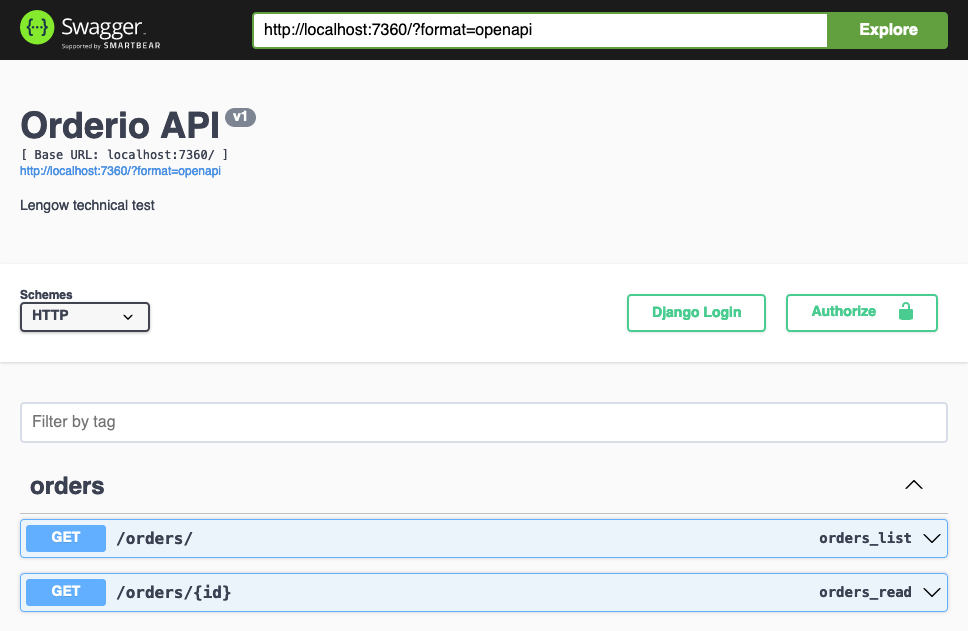

## Objectives

The goal is to retrieve commands from an XML file and manipulate them. You can use the default database system in Django, which is SQLITE.

Each task should be done following the best testing practices and respecting PEP8:
1. Create a Django project.
2. Create an app named "orders".
3. Create a model named "Order" reflecting the data presented in this file: `orders-test.xml`. You are not required to manage all the fields; 4-5 fields are sufficient.
4. In this app, create a Django command to retrieve the commands from the XML file and save them using the model you just created.
5. Create two endpoints with responses in JSON format (using either Django views or Django Rest Framework):
   - An endpoint to list the orders: /orders
   - An endpoint to display the details of an order: /orders/{id}


# Run the project

Run the project
```shell
# Build image
docker build --no-cache -t orderio .

# Run in tty window to allow ANSI coloring on output
# Mount volume for live editing
# Name container for better container management
docker run --rm -ti -p 7360:7360 -v .:/app --name orderio orderio
```

In another terminal window run the import command
```shell
# Run xml import command
docker exec -t orderio ./manage.py import_orders orders-test.xml
```

# Test endpoints
Open http://localhost:7360/ in a browser window and test the endpoints there directly using swagger.


